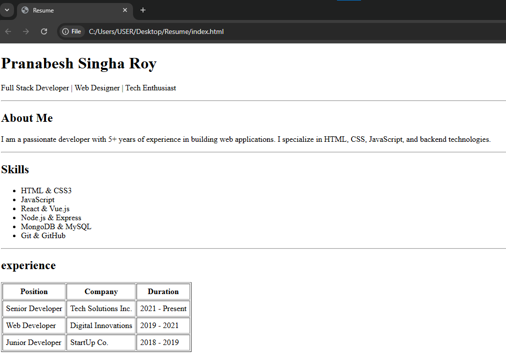
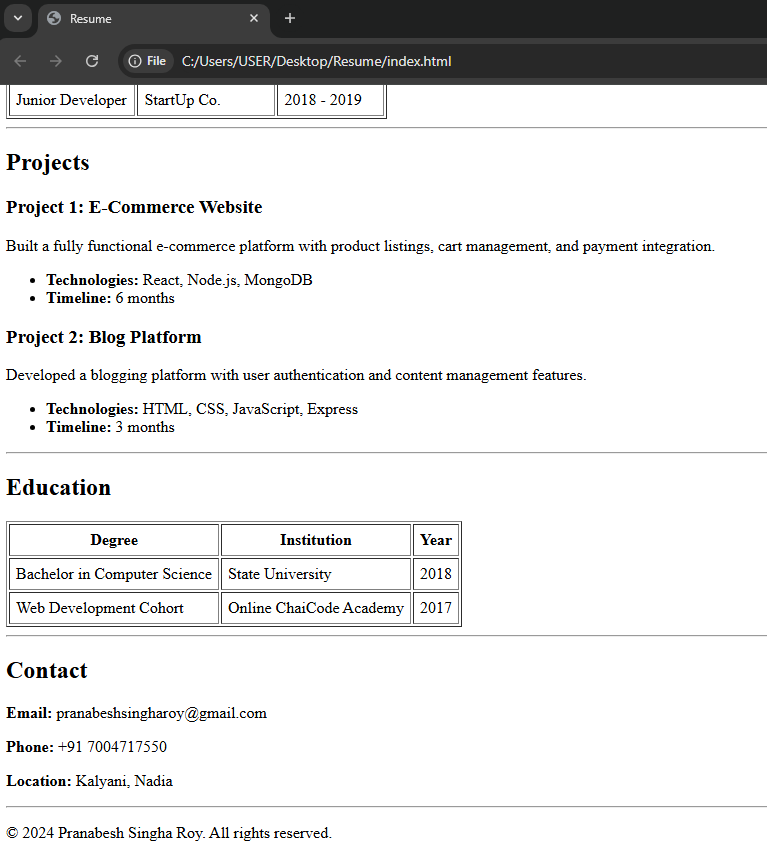

# Resume Website

A simple resume website created using **HTML5**.  
This project displays personal details, skills, experience, projects, education, and contact information in a clean and structured format.

---

## 📄 Project Overview

This resume webpage includes the following sections:

- Header with name and professional title
- About Me
- Skills
- Experience (table format)
- Projects
- Education (table format)
- Contact Information
- Footer with copyright

The project focuses on **semantic HTML structure** and clarity.

---

## 🛠️ Technologies Used

- HTML5

(No CSS or JavaScript is used in this version.)

## Webpage Screenshots for better Evaluation :

